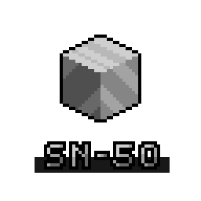

  

    
  

  

    
  

  <h3 align="center">SN-50 Specs</h3>

  

    Specifications of the SN-80 Fatansy Computer
  

## Table of Contents <!-- omit in toc --> 

- [About SN-50 Specs](#about-sn-50-specs)
- [Specifications](#specifications)
  - [System](#system)
  - [Machine](#machine)
  - [Cartridges](#cartridges)
- [Contributing](#contributing)
- [License](#license)

## About SN-50 Specs

SN-50 is a free and open source fantasy computer for building, playing and sharing resource-limited games.

This document provides all the details and instructions to build a minimal player for SN-50's cartridges.

## Specifications

### System

### Machine

### Cartridges

## Contributing

Contributions are what make the open source community such an amazing place to be learn, inspire, and create. Any contributions you make are **greatly appreciated**.

1. Fork the Project
2. Create your Feature Branch (`git checkout -b feature/AmazingFeature`)
3. Commit your Changes (`git commit -m 'Add some AmazingFeature'`)
4. Push to the Branch (`git push origin feature/AmazingFeature`)
5. Open a Pull Request

## License

Distributed under the MIT License. See `LICENSE` for more information.
